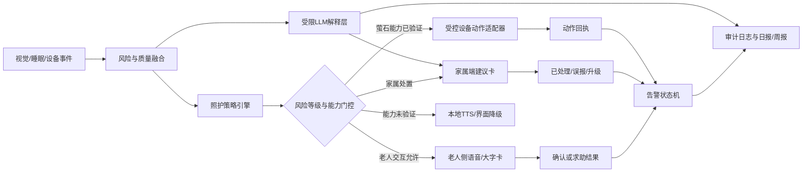
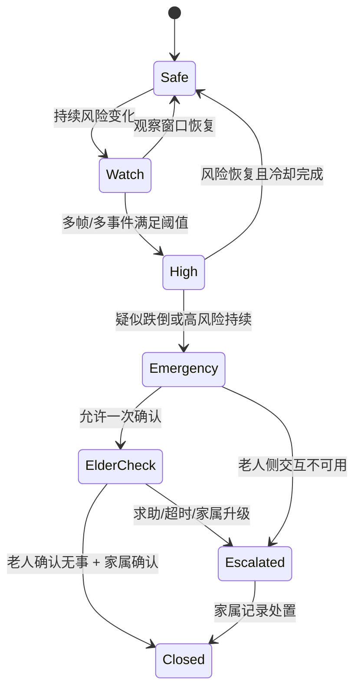

# 萤石双端照护智能体设计说明

**日期：** 2026-08-08  
**状态：** 待用户审阅  
**定位：** 比赛/研究原型；不构成医疗器械、心理健康诊断或紧急救援服务。

## 1. 目标与范围

本设计为“慧护安居”补充一个规则主导的照护智能体，将视觉跌倒风险、睡眠/行为趋势、告警状态和设备能力转成老人可理解、家属可执行的照护闭环。

智能体同时服务两端：

| 端 | 首要目标 | 不做什么 |
| --- | --- | --- |
| 老人端 | 少打扰的风险确认、求助入口、环境提醒与温和关怀 | 不做长对话、诊断、连续追问或自动呼救承诺 |
| 家属端 | 解释风险、展示证据、给出下一步、记录处置与生成摘要 | 不把模型分数伪装成医疗结论或已验证的设备能力 |

范围包括：跌倒高风险/疑似跌倒处置、夜间离床提醒、睡眠与身心状态变化的关怀邀请、日报/周报和萤石设备动作编排。诈骗识别仍为未来扩展，不进入本次智能体效果声明。

## 2. 设计原则

1. **规则优先，语言模型受限。** 风险升级、静默时段、冷却期、确认次数和设备动作由确定性策略决定；LLM 只能根据结构化证据生成解释、建议和摘要，不能直接发出设备命令。
2. **能力门控。** 每项萤石动作均须通过 `verified` 能力检查；`unavailable` 与 `not_verified` 只能生成降级提示，绝不能冒充已执行。
3. **一次确认，避免打扰。** 紧急事件最多发出一次老人侧确认；老人拒绝、沉默或超时后结束语音交互，转由家属端流程处置。
4. **人类最终决策。** 智能体建议而不替代家属、照护员或专业人员；心理风险仅为筛查/关怀建议。
5. **隐私最小化。** 默认以风险原因、骨架/事件摘要和状态为主；连续音视频不作为智能体上下文保存。
6. **可追溯。** 每条建议关联风险事件 ID、数据来源、质量状态、动作结果和生成时间。

## 3. 总体架构



### 3.1 智能体模块边界

| 模块 | 输入 | 输出 | 约束 |
| --- | --- | --- | --- |
| `care_policy` | 风险事件、时间、历史交互、能力清单 | 允许动作、文案键、升级策略 | 无 LLM；可单测 |
| `care_orchestrator` | 策略结果、设备适配器、通知通道 | 处置记录、状态迁移 | 只调用白名单动作 |
| `care_explainer` | 脱敏事件事实、趋势、规则原因 | 家属解释、建议、日报 | LLM 输出必须经模板/免责声明校验 |
| `elderly_interaction` | 老人确认/求助、无障碍偏好 | 简短语音/大字交互 | 一次确认、静默期、可退出 |
| `ezviz_action_adapter` | 已批准动作、设备能力 | 真实动作回执或降级原因 | 不持有/打印凭据；未经验证不调用 |
| `care_audit` | 上述全部事件 | 可回放审计记录 | 不保存连续原始音视频 |

## 4. 萤石平台能力编排

### 4.1 能力状态

设备能力不能用“支持/不支持”的二元值表示，统一使用：

| 状态 | 含义 | 智能体行为 |
| --- | --- | --- |
| `verified_available` | 已通过真实设备/API 实测并记录时间、设备型号和证据 | 可在策略允许时调用 |
| `declared_unverified` | 平台或设备资料声称可能支持，但未实测 | 不调用；向家属说明“待验证” |
| `unavailable` | 接口缺失、返回不可用或能力不支持 | 自动使用降级通道 |
| `failed` | 本次调用失败 | 记录失败，提示家属，禁止重复轰炸设备 |

### 4.2 当前项目可对接的能力

现有代码已具备以下安全边界：萤石 access token 获取、设备清单、授权播放地址、编码类型切换、设备对讲模式字段解析以及能力门控的通知投递边界。实际直播、对讲、主动广播、平台通知和 SDNL1 字段仍须逐项实测。

| 智能体意图 | 萤石动作 | 前置条件 | 失败/未验证降级 |
| --- | --- | --- | --- |
| “查看现场” | 获取授权播放地址，打开实时守护页 | `live_stream=verified_available` | 展示最近一次事件摘要；提示人工联系 |
| “关注床边” | 云台转到已配置预设位 | `ptz=verified_available`，且设备在许可时间内 | 显示“云台未验证”，不虚构镜头已转向 |
| “现场问候” | 对讲/广播播放固定确认语 | `two_way_audio` 或 `proactive_audio=verified_available` | 使用本地屏幕/手机 TTS；仅展示文字提示 |
| “保留事件证据” | 请求抓图或事件片段 | `snapshot=verified_available` 且已 opt-in | 保存结构化风险摘要，不保存画面 |
| “通知家属” | 平台通知或本地通知通道 | 通道实测且联系人已配置 | 站内告警卡 + 明确“外部通知未发送” |

### 4.3 萤石动作白名单

智能体不能根据自然语言自由拼接接口参数。仅允许以下 `action_key`：

```text
open_live_view
move_to_preset
request_snapshot
play_help_check
notify_family
create_care_summary
```

每个动作均需包含：`event_id`、`device_id`、`capability_state`、`operator`、`requested_at`、`result` 和脱敏失败原因。除了在 `verified_available` 状态下的白名单动作外，适配器不得访问萤石接口。

## 5. 老人端交互设计

### 5.1 双通道但一个交互模型

老人端同时支持摄像机扬声器语音和手机/平板大字界面；两者使用同一事件会话 ID，避免同一事件重复询问。语音无法使用时，大字界面接管；界面离线时，语音可独立完成一次确认。

| 场景 | 语音文案 | 大字界面 | 后续 |
| --- | --- | --- | --- |
| 疑似跌倒且风险达到紧急 | “我注意到您可能需要帮助。说‘我没事’，或按绿色按钮；需要帮助请说‘帮帮我’，或按红色按钮。” | 绿色“我没事”、红色“需要帮助” | 仅一次；无响应按策略通知家属 |
| 夜间起床高风险 | “夜里起床请先开灯，慢慢走。需要帮助时请说‘帮帮我’。” | “请先开灯，慢慢走” | 不强制确认；同类提醒有冷却期 |
| 持续作息变化 | 不主动播报 | 家属确认后可展示“最近睡眠有变化，愿意时可以做一次简短关怀问候。” | 仅在白天，最多每 7 天一次短邀请 |
| 老人主动求助 | “我已记录您的求助，会通知家属关注。” | 大红色“呼叫家人”反馈为“已记录” | 只能陈述实际成功的通知状态 |

### 5.2 适老化硬约束

- 页面仅保留一个主结论、两个确认按钮和一个返回/关闭操作；高风险卡片不超过 3 个动作。
- 大字模式默认字号不低于 24 px，按钮点击区域不小于 56×56 px，使用高对比色并同时保留文字，不只依赖红绿颜色。
- 语句短、一次只表达一件事；不用“抑郁”“诊断”“高危病情”等医疗化表述。
- 支持普通话文本/语音输入，允许按钮、语音和家属代操作；听不清/未识别时只提供一次重试。
- 21:00–08:00 默认静默。紧急跌倒确认可例外一次；普通关怀、问卷邀请和日报播报不得例外。
- 老人可以随时说“停止提醒”或点击“暂不需要”，系统立即进入当前事件静默状态。

### 5.3 心理健康交互边界

沿用现有交互策略：短问候最短间隔 7 天，完整 GDS-15 邀请最短间隔 28 天；仅在持续变化且非静默时段提出邀请。所有结果固定附带“筛查而非诊断”声明，推荐联系家属/专业人员，不做疾病判断。

## 6. 家属端照护助手

### 6.1 事件卡片

每个事件卡片固定呈现事实、解释和操作，禁止只给模糊 AI 结论。

```text
【高风险】夜间离床后步态不稳
时间：02:14    证据质量：vision_only
已观察到：重心横向摆动升高、躯干倾斜变化；未发现已验证的睡眠字段。
建议：先通过电话或现场确认；检查床边照明和通道障碍物。
操作：查看现场｜联系老人｜标记误报｜升级处理
```

家属操作语义：

| 操作 | 状态迁移 | 需要记录 |
| --- | --- | --- |
| 已处理 | `new → confirmed → closed` | 处理人、时间、处置说明 |
| 标记误报 | `new/confirmed → false_positive` | 误报原因类别 |
| 升级 | `new/confirmed → escalated` | 升级对象、外部通知结果 |
| 联系老人 | 保持原告警状态 | 通道、成功/失败、回访摘要 |

### 6.2 问答与报告

家属可询问“为什么提示高风险”“今天状态如何”“近 7 天有什么变化”“如何降低夜间风险”。解释层只接收脱敏结构化事实；输出遵循：

1. 先说明风险等级和证据质量；
2. 再列出 1–3 条事实原因；
3. 给出不超过 3 条可执行建议；
4. 说明未验证数据或不确定性；
5. 涉及心理状态时附带筛查边界。

日报/周报以趋势、已处置事件、未处理事项和建议复盘组成，不包含连续原始音视频。

## 7. 策略状态机



升级规则由风险级别、证据质量、老人响应、家属响应和可用通知通道共同决定。`vision_only` 可以触发可行动的安全建议，但不得被描述成多模态已确认；低质量或缺失来源不自动升级为紧急。

## 8. 接口与数据契约

### 8.1 结构化事实输入

```json
{
  "event_id": "evt_20260808_001",
  "resident_id": "resident_001",
  "kind": "fall_risk",
  "level": "high",
  "score": 0.72,
  "quality": "vision_only",
  "observations": ["夜间离床", "重心横向摆动升高"],
  "device_capabilities": {
    "live_stream": "verified_available",
    "ptz": "declared_unverified",
    "two_way_audio": "unavailable"
  },
  "interaction_history": {
    "fall_check_sent": false,
    "last_short_checkin_at": null
  }
}
```

### 8.2 受控响应

```json
{
  "event_id": "evt_20260808_001",
  "elderly_prompt_key": "night_risk_reminder",
  "family_summary": "夜间离床后观察到步态不稳，建议先联系老人并检查照明。",
  "allowed_actions": ["open_live_view", "notify_family"],
  "blocked_actions": [{"action": "move_to_preset", "reason": "ptz_declared_unverified"}],
  "disclaimer": "风险提示仅供辅助照护，不构成医疗诊断。"
}
```

## 9. 失败处理与安全边界

| 情形 | 行为 |
| --- | --- |
| LLM 不可用/超时 | 返回规则模板解释；告警与设备动作不受影响 |
| 萤石 API 失败 | 记录 `failed`，不重复重试轰炸设备；转为家属端手动联系建议 |
| 语音能力未验证 | 不调用对讲；改用大字卡/本地 TTS，标记降级 |
| 老人沉默 | 结束本次问询，不把沉默解释为同意或拒绝；按事件策略通知家属 |
| 误报被标记 | 写入误报类型，供后续阈值/规则复盘；不自动改变医学/心理结论 |
| 数据来源缺失 | 明确 `unavailable`，不以零值或模拟生理数据补齐 |

## 10. 验收与测试

### 10.1 功能测试

| 用例 | 期望结果 |
| --- | --- |
| 高风险事件 + 已验证语音 | 最多一次确认语；生成家属处置卡和审计记录 |
| 高风险事件 + 语音未验证 | 不调用对讲；显示本地/界面降级原因 |
| 家属点击“查看现场” | 仅在直播能力已验证时请求授权播放地址 |
| 家属标记误报 | 状态正确迁移并记录原因 |
| 夜间普通关怀 | 21:00–08:00 不发起提示 |
| 持续作息变化 | 短问候 7 天冷却、完整筛查 28 天冷却生效 |
| LLM 服务不可用 | 仍生成规则模板和安全免责声明 |

### 10.2 老人可用性测试

邀请至少 3 名健康成年模拟用户和 1–2 名家属/照护者完成以下任务，不诱导老人做跌倒动作：

- 在语音或大字卡上完成“我没事/需要帮助”确认；
- 找到并使用“停止提醒”；
- 家属在 3 步内完成“查看原因—联系—已处理”；
- 检查字体、对比度、按钮、文案是否能被清楚理解；
- 记录完成率、平均步骤、误操作次数、理解反馈和改进项。

### 10.3 萤石实测材料

每项真实能力需保存：设备型号（脱敏）、测试时间、调用意图、能力状态、API/设备回执、失败原因、截图/日志索引。至少分开验证设备清单、授权取流、云台、抓图、语音/对讲、通知和 SDNL1 字段；未测项目保持 `declared_unverified` 或 `unavailable`。

## 11. 非目标

- 不实现自由闲聊、角色扮演或替代家属的陪伴机器人。
- 不对心理疾病、跌倒后伤情或身体指标作医学诊断。
- 不自动呼叫急救服务，也不承诺一定送达外部通知。
- 不使用未经授权的音视频持续上传或训练。
- 不将未实测的萤石接口、SDNL1 数据或云端推理写为已实现成果。

## 12. 实施优先级

1. **P0：** 结构化风险事实、策略引擎、老人双通道确认、家属处置卡、审计日志、规则模板降级。
2. **P1：** 萤石能力注册表、直播/云台/对讲的真实回执接入、日报周报、适老化无障碍设置。
3. **P2：** 受限 LLM 解释层、家庭偏好、社区多老人队列和趋势复盘。

本设计完成后，原开发计划中第 4、5、6、10、12、13.5、14、15 与 20 章将以本说明为准补充或替换智能体相关表述，确保“已实现、待实测、未来扩展”口径一致。
