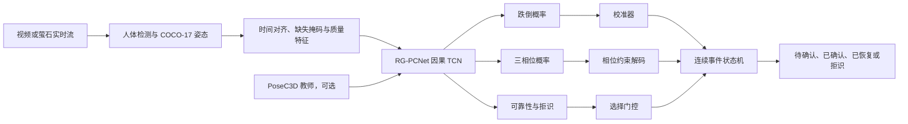

# RG-PCNet 可靠性门控相位一致时序学生模型设计规格

- 日期：2026-08-10
- 状态：待用户书面审阅
- 适用仓库：`jj-s2/look-model`
- 目标分支：`codex/elderly-monitoring`

## 1. 决策摘要

本阶段不直接实现完整六状态半马尔可夫生存模型，也不把当前分段视频结果包装成真实连续监护结论。优先建立一条可复现、可校准、可拒识、可做连续事件评估的算法链路，并在此基础上实现核心创新 **Reliability-Gated Phase-Consistent Temporal Student（RG-PCNet，可靠性门控相位一致时序学生模型）**。

RG-PCNet 以 COCO-17 姿态序列为主输入，以轻量因果 TCN 为连续推理主体，同时输出：

1. 跌倒概率；
2. 三类粗粒度动作相位；
3. 输入可靠性与拒识信号；
4. 经事件状态机解码后的告警状态。

现有 PoseC3D 保留为高精度基线和可选教师模型。模型的创新结论必须建立在外层留一受试者验证、内层校准、连续流事件指标、跨域压力测试和消融实验之上。

## 2. 现状证据与约束

### 2.1 已有证据

- 现有 PoseC3D 分段视频基线在 151 个暂存片段上的固定 argmax 综合 F1 为约 0.908，但这是受控片段级结果，不能代表家庭连续监控表现。
- 当前 PA-DTSF 留一验证确认综合 F1 约为 0.689，候选优化实验约为 0.727，均未满足自动晋级条件。
- 某交接报告中出现约 0.823 且“已晋级”的数字，与机器可读实验产物冲突；在复核前不得进入正式报告。
- 当前数据锁约含 160 个片段、4 名受试者，规模不足以支持强泛化结论；置信区间只能作为描述性结果。

### 2.2 当前实现风险

- 训练脚本实际按单样本更新，缺少规范 DataLoader、验证集早停和最佳检查点恢复。
- `seed` 参数未形成完整确定性链路，增强模块未进入训练路径。
- 相位顺序损失未真正计算，拒识头缺少有效监督。
- 训练与评估中存在短片质量固定为 0、长片固定为 1 的标签捷径风险。
- 温度标定可能产生极端值，且小受试者数时存在退化回退。
- 离线与在线归一化使用的髋部关键点索引不一致。
- 服务告警阈值与发布标定配置分离，存在训练、评估、部署行为漂移。
- 当前相位标签不完整：日常活动多为 `normal`，跌倒样本缺少可信的下降、冲击后和恢复时间边界。

这些问题必须先作为算法可信性的一部分修复，而不是单纯继续堆叠网络结构。

## 3. 范围与非目标

### 3.1 本阶段范围

- 建立可复现的姿态时序训练数据管线。
- 实现轻量因果 TCN 学生模型及三任务输出头。
- 实现独立的可靠性监督、拒识和选择性风险评估。
- 实现粗粒度相位监督与可微转移一致性约束。
- 支持 PoseC3D 教师蒸馏，但保持教师可选。
- 建立嵌套留一受试者验证、校准、连续事件评估和发布门禁。
- 将同一份版本化发布配置用于离线评估和在线服务。

### 3.2 本阶段非目标

- 不实现完整六状态半马尔可夫模型或生存时间预测。
- 不把萤石云当作自定义模型训练或推理平台；模型仍运行在自有服务器。
- 不在缺乏标签的情况下宣称实现了提前预测、恢复识别或心理健康诊断。
- 不用与输入同源的姿态规则生成“真值”后再证明模型学会了这些规则。
- 不以单次随机划分、测试集调阈值或片段级随机拆分作为正式性能依据。

## 4. 系统边界与数据流

训练、离线回放与线上服务必须共享特征定义、归一化、窗口步长、校准器和状态机配置。

## 5. 输入数据契约

### 5.1 基础输入

每个样本由长度为 `T` 的时间序列组成，姿态关键点采用 COCO-17 顺序。基础张量包括：

- `xy`: `[T, 17, 2]`，归一化坐标；
- `confidence`: `[T, 17]`，关键点置信度；
- `missing_mask`: `[T, 17]`，缺失或插值标记；
- `dt`: `[T]`，相邻帧实际时间间隔；
- `frame_valid`: `[T]`，整帧可用性；
- `labels`: 跌倒标签、可选相位标签及标签掩码；
- `metadata`: 数据集、受试者、场景、摄像机、原始片段和时间戳标识。

### 5.2 派生特征

仅从当前和历史帧计算因果特征：

- 关键点速度与加速度；
- 髋部中心位移和垂直速度；
- 躯干方向、长宽比和人体框面积变化；
- 可见关键点比例、平均置信度、连续缺失长度；
- 帧率抖动、插值比例和窗口有效比例。

所有索引、坐标系和尺度规则由单一共享模块定义，禁止离线与在线各自实现。

### 5.3 标签与来源

粗粒度相位固定为：

- `0 normal`：正常活动或非跌倒动作；
- `1 descent_or_impact`：失衡下降至触地冲击的合并阶段；
- `2 postfall_or_recovery`：倒地后静止、尝试起身或恢复阶段。

相位标签必须附带 `label_source` 与 `review_status`。可用于主监督的来源仅包括人工复核标注、数据集官方时间边界或独立外部传感器。由同一姿态序列的高度、速度或角度规则生成的标签只能作为辅助弱标签，并必须在报告中单列，同时进行“移除规则同源特征”的循环性审计。

若当前批次没有可信相位标签，则 `phase_mask=0`，主相位交叉熵不得伪造监督；该批次仍可参与跌倒分类、可靠性学习和一致性训练。

## 6. RG-PCNet 模型设计

### 6.1 时序主干

主干采用 4 个残差因果 TCN block。每个 block 由深度可分离一维卷积、归一化、SiLU、dropout 和残差连接组成，膨胀率建议为 `1, 2, 4, 8`。默认隐藏维度 128，参数量和单窗口延迟必须记录。

网络只读取当前及历史帧，确保在线回放和实时推理一致。输入缺失不以零值隐式表达，而通过显式掩码和可靠性特征进入网络。

### 6.2 输出头

模型返回统一结构：

- `fall_logits`: `[B, T]`；
- `phase_logits`: `[B, T, 3]`；
- `reliability_logits`: `[B, T]`；
- `window_embedding`: `[B, D]`，仅供蒸馏或审计；
- `valid_mask`: `[B, T]`。

窗口级跌倒分数由最后一个有效时间点或掩码池化得到，具体方式作为配置固化，不允许评估和服务各自选择。

### 6.3 可靠性门控

可靠性头表示“当前输入是否足以作出可信判断”，不是跌倒概率的替代物。线上决策规则为：

1. 使用折内标定器得到 `p_fall_calibrated`；
2. 使用 `p_reliable` 与输入质量硬约束判断是否可决策；
3. 若可靠性低于阈值，则输出 `abstain`，不生成确定性跌倒结论；
4. 仅在可决策样本上应用告警阈值和事件状态机。

不得简单把跌倒概率与可靠性概率相乘后再称为已校准跌倒概率。

### 6.4 相位一致性

允许的主要相位转移为：

- `normal -> normal | descent_or_impact`；
- `descent_or_impact -> descent_or_impact | postfall_or_recovery | normal`；
- `postfall_or_recovery -> postfall_or_recovery | normal`。

允许 `descent_or_impact -> normal` 以表示近跌倒或被扶住后的恢复。禁止 `normal -> postfall_or_recovery` 和 `postfall_or_recovery -> descent_or_impact` 的直接跳转。

可微转移损失按相邻时刻相位分布在禁止边上的联合概率求和，而不是对 argmax 后的离散标签计算：

`L_transition = mean(sum(P_t(i) * P_{t+1}(j) for (i,j) in forbidden_edges))`

该损失仅在连续有效帧上计算，并按真实 `dt` 屏蔽大时间间隔。

## 7. 损失函数与监督策略

总损失为：

`L = w_fall L_fall + w_phase L_phase + w_trans L_transition + w_rel L_reliability + w_cons L_consistency + w_kd L_distill`

### 7.1 跌倒损失

默认使用带类别权重的 BCEWithLogitsLoss。只有在固定验证协议下证明 focal loss 改善受试者宏平均指标时才切换。类别权重只能从外层训练折计算。

### 7.2 相位损失

对具有可信标签且 `phase_mask=1` 的帧计算三类交叉熵。辅助弱标签必须使用独立较低权重，并在消融中单独移除。

### 7.3 可靠性损失

可靠性监督来自可审计的输入损坏和质量目标：

- 关键点随机遮挡或成块缺失；
- 置信度塌陷；
- 帧丢失与时间抖动；
- 短时冻结、重复帧和插值过量；
- 合理范围内的摄像机平移、尺度与轻微旋转。

损坏强度映射到连续可靠性目标，严重不可判定样本目标接近 0，干净且完整样本目标接近 1。可靠性头同时用 BCE/回归损失和选择性风险约束训练，防止“全部拒识”获得表面低错误率。

### 7.4 一致性损失

对同一序列的干净视图和可判定损坏视图约束跌倒与相位分布一致；对已经不可判定的严重损坏，只要求可靠性下降，不强迫分类一致。

### 7.5 教师蒸馏

PoseC3D 教师为可选项。每个外层折只能使用该折训练受试者训练或生成教师 logits，严禁使用外层测试受试者调参。蒸馏仅对高置信教师输出启用，并报告无教师、固定教师和折内教师三种结果。

## 8. 训练协议

### 8.1 数据加载

- 使用正式 `Dataset` 与 `DataLoader`，默认 batch size 8；
- 训练集允许 shuffle，验证和测试固定顺序；
- 变长序列使用 padding 与 `valid_mask`；
- `num_workers`、随机种子、生成器和 worker 初始化显式配置；
- 保存数据清单哈希、代码提交、配置、随机种子和环境信息。

### 8.2 训练控制

- 优化器默认 AdamW；
- 使用梯度裁剪和学习率调度；
- 以内层受试者宏平均事件 F1 为早停主指标，并同时监控 NLL、Brier 和覆盖率；
- 只保存最佳验证检查点，测试前恢复该检查点；
- 默认运行 3 个种子，汇报均值、标准差和每个受试者结果；
- 任何超参数、阈值、温度和状态机参数都不得查看外层测试折后修改。

### 8.3 训练失败条件

出现以下任一情况时实验标记为无效，不进入比较表：

- 外层测试受试者泄漏到训练、早停、标定或阈值搜索；
- 某折只有单一类别且代码静默继续计算无意义指标；
- 标定器产生非有限数值或边界外温度；
- 推理配置与评估配置哈希不一致；
- 相位标签来源缺失或无法追溯。

## 9. 校准、阈值与拒识

### 9.1 嵌套校准

外层采用 LOSO。每个外层训练集合内部再按受试者生成 OOF 预测，用这些 OOF 预测拟合温度、可靠性阈值、跌倒阈值和状态机参数。外层测试受试者仅用于最终一次评估。

### 9.2 稳健温度缩放

温度限制在 `[0.5, 5.0]`。仅当内层 OOF 的 NLL 或 Brier 得到实际改善且类别完整时启用；否则回退为温度 1。温度、拟合样本数、类别计数和回退原因必须写入折产物。

### 9.3 阈值选择

阈值目标不是只最大化 F1，而是在召回率下限、误报事件率上限和最低覆盖率约束下选择。若不存在可行阈值，该折应明确失败，不得静默降低约束。

### 9.4 选择性指标

除传统指标外必须报告：

- 覆盖率；
- 已决策样本上的选择性风险；
- risk-coverage curve 与 AURC；
- 拒识样本中真实跌倒比例；
- 不同损坏类型和严重度的可靠性响应。

## 10. 连续事件状态机

统一状态定义：

- `monitoring`：正常监测；
- `suspected`：跌倒分数或下降相位达到候选条件；
- `confirmed`：在规定窗口内满足连续证据；
- `postfall`：倒地后或恢复阶段；
- `recovered`：恢复正常；
- `abstain`：输入不可靠，等待新证据或提示设备检查。

状态机按时间戳而非固定帧数计时。确认、冷却、合并和恢复参数来自折内 OOF 调参，最后写入一个版本化 `release_config`。离线评估、回放演示和在线服务必须加载同一份配置；禁止在服务代码内硬编码另一阈值。

## 11. 评估设计

### 11.1 数据划分

- 主评估：外层 LOSO，按受试者完全隔离；
- 调参与校准：仅使用外层训练受试者的内层 OOF；
- 外部压力测试：至少加入一个跨数据集或更接近非受控环境的数据集；
- 连续流测试：按原始时间顺序拼接 ADL、近跌倒和跌倒片段，并保留片段边界供审计，但模型不可见边界。

### 11.2 必报指标

片段级指标：

- F1、精确率、召回率、特异度、AUROC、AUPRC；
- NLL、Brier、ECE；
- 每受试者指标和宏平均。

事件级指标：

- 事件召回率与事件精确率；
- 每小时误报事件数；
- 告警延迟中位数与 P90；
- 重复告警率；
- 恢复识别正确率；
- 拒识覆盖率与 AURC。

### 11.3 对照与消融

固定协议下至少比较：

1. 当前规则/PA-DTSF；
2. PoseC3D 基线；
3. 仅 TCN 跌倒头；
4. TCN + 相位头；
5. TCN + 相位转移一致性；
6. TCN + 可靠性门控；
7. 完整 RG-PCNet；
8. 完整模型 + PoseC3D 蒸馏。

关键审计消融：

- 移除姿态派生弱相位标签；
- 移除与弱标签同源的高度、速度和角度特征；
- 移除质量特征，检查是否存在数据集或时长捷径；
- 清洁输入与各类损坏输入分别评估；
- 折内教师与全局教师严格分开。

## 12. 发布晋级门禁

候选模型只有同时满足以下条件才可替换当前发布模型：

- 外层 LOSO 受试者宏平均事件 F1 改善，且不是由单一受试者贡献；
- 召回率不低于既定下限；
- 每小时误报事件数不劣化；
- NLL 或 Brier 至少一项不劣化，且 ECE 无明显恶化；
- 可靠性门控达到最低覆盖率，AURC 优于无门控模型；
- 连续流与跨域压力测试均无灾难性退化；
- 三个种子结果稳定，全部实验产物可复现；
- 自动测试、模型清单校验和服务回放测试通过。

由于当前仅有 4 名受试者，不设置缺乏统计依据的固定“显著性”门槛；正式报告应同时展示逐受试者差值、种子方差和描述性 bootstrap 区间。

## 13. 测试策略

### 13.1 单元测试

- 特征维度、关键点索引和离线/在线归一化一致；
- padding、mask、变长序列和缺失帧处理正确；
- 因果卷积不读取未来帧；
- 相位禁止边损失对正确和错误转移有预期响应；
- 严重损坏使可靠性目标和输出下降；
- 单类别折、长度不匹配和非有限标定输入明确报错；
- 发布配置能够完整序列化与校验。

### 13.2 集成测试

- 小型合成数据可在 CPU 上过拟合，证明梯度链路完整；
- 一次微型 LOSO 能完成训练、内层校准、外层评估和产物保存；
- 同一输入在离线评估器和服务预测器中得到一致结果；
- 服务加载的模型、校准器和状态机配置哈希匹配；
- 低质量流进入 `abstain`，恢复后能够回到 `monitoring`。

### 13.3 回归测试

- 保留现有 PoseC3D 与 PA-DTSF 基线结果；
- 修复现有两个失败测试后，将其作为回归门禁；
- 图表只读取机器可读实验产物，不接受手工填写指标。

## 14. 实施边界与顺序

后续实施计划按以下依赖顺序拆分，但每一步必须先写失败测试：

1. 修复现有测试、数据批处理、确定性和归一化一致性；
2. 建立统一数据契约与损坏增强；
3. 实现 RG-PCNet 主干、输出头和损失；
4. 实现嵌套校准、拒识指标和发布配置；
5. 实现连续流回放、状态机和事件级评估；
6. 接入可选 PoseC3D 折内教师；
7. 运行基线、消融、跨域压力测试并生成图表；
8. 只有通过发布门禁后，才更新线上模型和正式报告结论。

## 15. 验收标准

设计落地完成的最低验收条件为：

- 训练、校准、评估和服务配置只有一个事实来源；
- 模型能在 GPU 上训练并在 CPU/GPU 上做因果推理；
- 没有可信相位标签时不会伪造相位监督；
- 可靠性低时能够拒识，并有覆盖率与风险证据；
- 外层测试受试者未参与任何模型选择；
- 连续事件级指标、标定指标和传统分类指标同时生成；
- 每张对外数据图均可追溯到实验 JSON、配置、提交和模型哈希；
- 未通过晋级门禁的候选模型不会自动替换当前发布版本。
